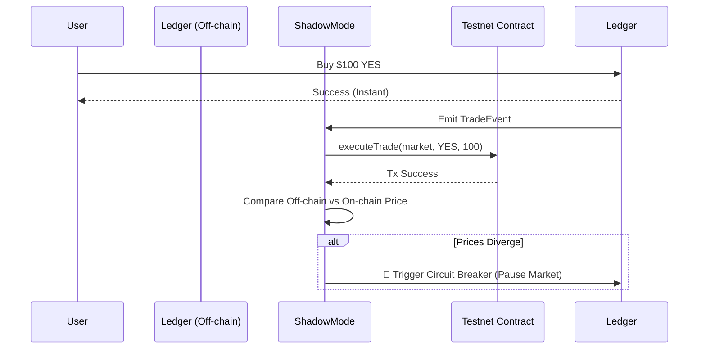

# Predix Hybrid Wallet & Shadow Mode Architecture

This document outlines the architecture for transitioning from off-chain simulation to real USDC trading, ensuring maximum security, zero latency for users, and rigorous testing via Shadow Mode.

## 🏗️ 1. Hybrid Wallet System

To provide a seamless, Web2-like experience while maintaining Web3 security, Predix uses a hybrid wallet approach.

### A. Custodial Wallets (For Instant Onboarding)
- When a user signs up (e.g., via Email/Google), an EVM-compatible HD Wallet is generated.
- **Security:** The private key is NEVER stored in plain text. It is encrypted using AWS KMS (Key Management Service) or GCP Secret Manager. The Node.js backend only holds the KMS reference/encrypted string.
- **Usage:** This wallet acts as the user's personal "Deposit Address".

### B. External Wallets (For Crypto Natives)
- Users can connect MetaMask, WalletConnect, or Coinbase Wallet.
- Authentication is handled via **SIWE (Sign-In with Ethereum)**. The user signs a nonce, proving ownership of the address, which is then linked to their Predix account.

## ⚡ 2. Instant Trading (Off-Chain Ledger)

On-chain trading (even on L2s like Polygon) is too slow and expensive for high-frequency prediction markets. We use a Centralized Exchange (CEX) model.

1. **Deposit:** User sends USDC to their Custodial Wallet address. A blockchain listener detects the `Transfer` event and credits the user's off-chain `Balance` in PostgreSQL.
2. **Sweep:** Funds are periodically swept from Custodial Wallets to a highly secure **Cold Wallet** (Multi-sig).
3. **Trading:** When a user buys "YES", the `LedgerService` instantly deducts their off-chain balance and updates the AMM pool. **Latency: < 50ms.**
4. **Withdrawal:** User requests a withdrawal. The system deducts the off-chain balance and queues an on-chain transaction from the **Hot Wallet**.

## 🌑 3. Shadow Mode (Safe Transition to Mainnet)

Before launching real USDC trading on Mainnet, we must ensure the Smart Contracts perfectly match the off-chain AMM logic.

**How Shadow Mode Works:**
1. Users trade normally on the app using "Play Money" (Simulation Phase).
2. The `LedgerService` processes the trade instantly off-chain.
3. In the background, the `ShadowModeService` takes that exact trade and submits it to a **Testnet Smart Contract** (e.g., Polygon Amoy).
4. **State Verification:** The system compares the off-chain AMM price with the Testnet Contract's price.
5. **Circuit Breaker:** If the Testnet contract reverts (fails) or the prices diverge, a Circuit Breaker is triggered, alerting the team to a potential exploit or math error *before* real money is involved.

