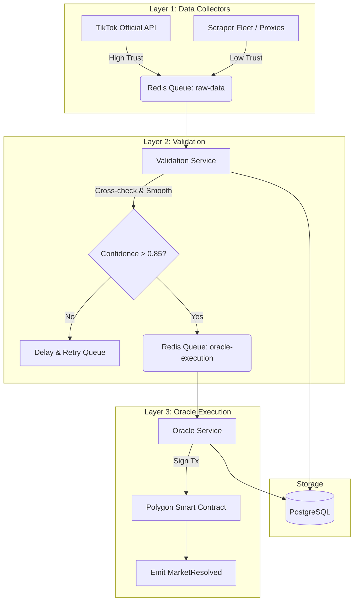

# Predix Oracle & Data Pipeline Architecture

This document outlines the production-grade hybrid oracle system for Predix, designed to fetch, validate, and execute real-world data (TikTok, TV ratings) onto the Polygon blockchain.

## 🏗️ System Architecture

The system is divided into 3 distinct layers, orchestrated by BullMQ and managed via NestJS.



## ⛓️ Smart Contract Integration (Solidity)

The Oracle Service interacts with the `PredixMarket.sol` contract. The contract uses a modifier to ensure only the whitelisted Oracle wallet can resolve markets.

```solidity
// SPDX-License-Identifier: MIT
pragma solidity ^0.8.20;

contract PredixMarket {
    address public oracle;
    
    event MarketResolved(uint256 indexed marketId, bool outcome, uint256 timestamp);

    modifier onlyOracle() {
        require(msg.sender == oracle, "Unauthorized: Only Oracle");
        _;
    }

    function resolveMarket(uint256 marketId, bool outcome) external onlyOracle {
        // 1. Verify market is open
        // 2. Set outcome
        // 3. Unlock funds for winning pool
        emit MarketResolved(marketId, outcome, block.timestamp);
    }
}
```

## 🛡️ Security & Mitigation Strategies

1. **Fake Engagement / View Botting:**
   - *Mitigation:* The Validation Layer calculates a `timeStability` score. Sudden, unnatural spikes (e.g., 1M views in 5 minutes) trigger an `anomalyDetected` flag, pausing resolution for manual/multi-sig review.
2. **Scraper Failure / API Downtime:**
   - *Mitigation:* BullMQ implements exponential backoff. If the Official API is down, the system relies on the Scraper Fleet. If both fail, the resolution window is extended automatically.
3. **Oracle Manipulation (Private Key Compromise):**
   - *Mitigation:* The Oracle wallet is restricted by a Time-Lock or Multi-Sig contract for high-value markets. The backend uses AWS KMS / GCP Secret Manager to sign transactions without exposing the raw private key to the Node.js environment.
